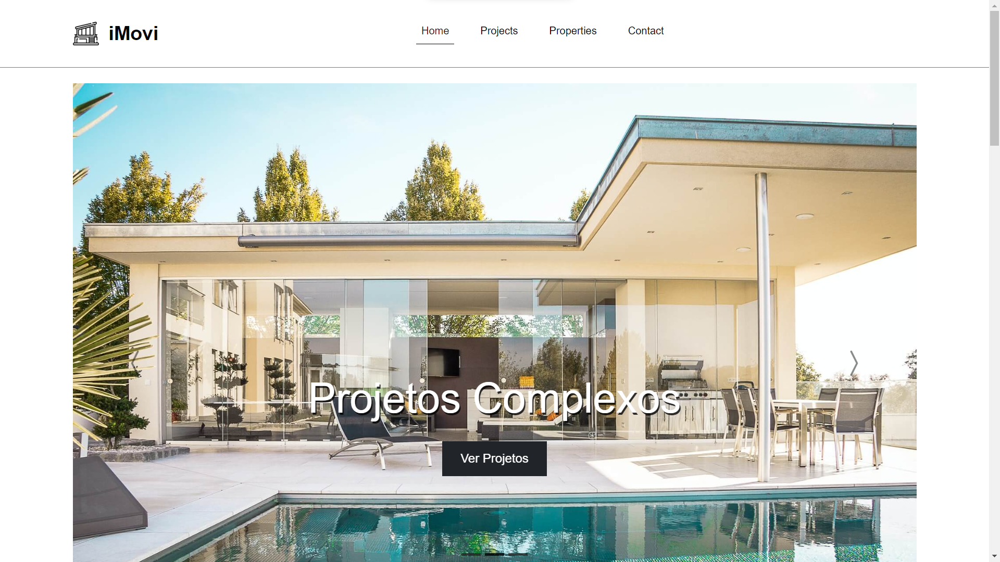
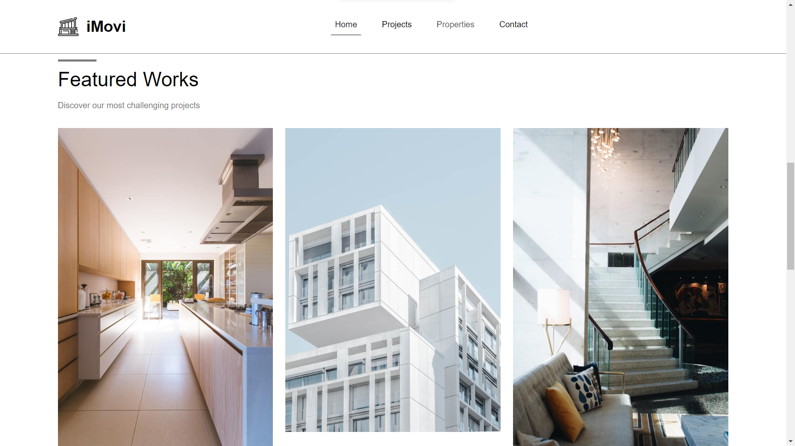
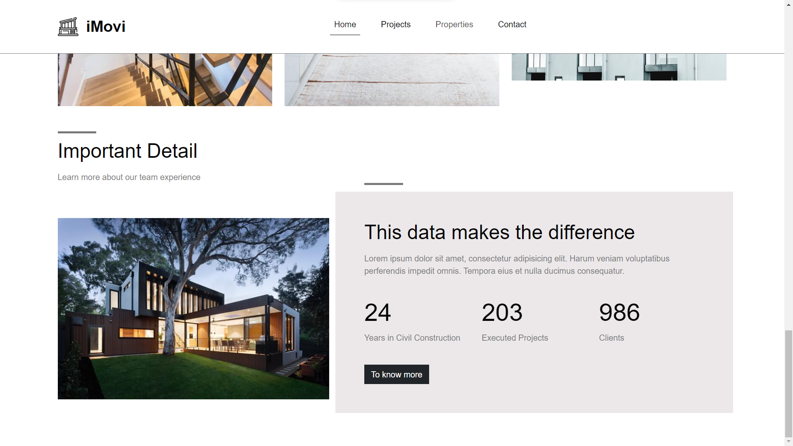

<!-- Título -->

<h1 align="center">iMovi</h1>

<!-- Descrição -->

Projeto desenvolvido com estilização em Bootstrap.

<!-- Súmario -->

 <a href="#rodando-a-aplicação">Rodando a Aplicação</a> •
 <a href="#tecnologias">Tecnologias</a> •
 <a href="#autor">Autor</a>

<!-- Site -->

<h2 align="center">Site</h2>

 <a href="https://matheuspalmieri.github.io/iMovi/">Site Do Projeto</a>

### Demo

 

Home

 

 

Features

 

 

Detail

 

---

### Rodando A Aplicação

<a href="https://matheuspalmieri.github.io/iMovi/" target="_blank">Site Do Projeto</a>

---

### Tecnologias

As seguintes ferramentas foram usadas na construção do projeto:

- [HTML](https://www.html.com/)
- [CSS](https://html.com/css/)
- [Bootstrap](https://getbootstrap.com/)

---

### Autor

Create for <b>`Matheus Palmieri`</b>👨‍💻

 
 

🎉Projeto iMovi Finalizado🚀

